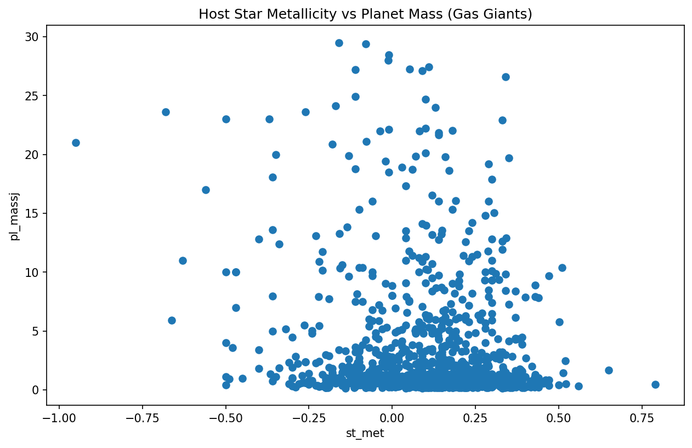

# SES4U Capstone — Gas Giant Frequency & Stellar Metallicity

> A replication study of the Metallicity–Planet Mass correlation using live data from the NASA Exoplanet Archive.
> *Submitted to the Journal of Emerging Investigators (JEI) SES4U, 2026*

---

## Research Question

Do stars with higher iron content ([Fe/H]) preferentially host more massive gas giant planets?

This study investigates the **Core Accretion Model** of planetary formation, which predicts that metal-rich protoplanetary disks can more rapidly build the solid rocky cores required to gravitationally accrete hydrogen gas, \\\\producing Jupiter-class planets. We test this prediction empirically using the largest available catalog of confirmed exoplanets.

---

## Hypothesis

Stars with higher stellar metallicity ([Fe/H]) will host planets with statistically greater mass, consistent with the Core Accretion Model first rigorously documented by Fischer & Valenti (2005).

---

## Dataset

| Property | Value |
|---|---|
| Source | [NASA Exoplanet Archive](https://exoplanetarchive.ipac.caltech.edu/) |
| Table | `pscomppars` (Planetary Systems Composite Parameters) |
| Access Method | Table Access Protocol (TAP) API |
| Access Date | May 2026 |

The `pscomppars` table was chosen deliberately over the standard `ps` table: NASA's algorithm selects the single most accurate, peer-reviewed measurement per planet, ensuring one definitive row per confirmed exoplanet and preventing artificial sample inflation.

**Columns used:**

| API Code | Description |
|---|---|
| `pl_name` | Planet identifier |
| `pl_bmasse` | Planet mass (Earth masses) |
| `st_metfe` | Stellar metallicity ([Fe/H] ratio) |
| `pl_massjlim` | Limit flag for planet mass |
| `st_metfelim` | Limit flag for stellar metallicity |

---

## Data Pipeline (`dataquery.py`)

The cleaning pipeline enforces the following steps in order:

1. **Extraction** — Live query of `pscomppars` via the NASA TAP API into a Pandas DataFrame.
2. **Truncation** — All columns except the five listed above are dropped to reduce memory footprint.
3. **Limit flag filtering** — Any row where `pl_massjlim` or `st_metfelim` equals `1` or `-1` is removed. These values indicate a theoretical upper/lower bound rather than a direct measurement, and including them would introduce non-empirical data into the statistical model.
4. **Null removal** — Rows with `NaN` in either `pl_bmasse` or `st_metfe` are dropped via `dropna()`.
5. **Scope filter** — Analysis is restricted to confirmed gas giants (`pl_bmasse > 50` Earth masses) to isolate the population predicted by the Core Accretion Model.
6. **Export** — The cleaned DataFrame is written to `cleaned_exoplanet_data.csv`.

---

## Statistical Analysis (`Plotter.py`)

A linear regression was performed on the cleaned gas-giant sample using `scipy.stats.linregress`, with stellar metallicity ([Fe/H]) as the independent variable and planet mass (Earth masses) as the dependent variable.

### Results

| Statistic | Value |
|---|---|
| R² | 0.0228 |
| p-value | 0.000001 |

**Interpretation:** The p-value of 0.000001 is far below the α = 0.05 significance threshold, hence this confirms a statistically significant positive relationship between stellar metallicity and gas giant mass without issue. The low R² value indicates that metallicity alone explains only ~2.3% of the variance in planet mass, which is expected here. Planetary formation is governed by differing amounts of additional variables (disk mass, orbital dynamics, stellar age), so the statistical significance still supports the Core Accretion Model.

### Figure


*Scatter plot of stellar [Fe/H] (x-axis) vs. planet mass in Earth masses (y-axis) for confirmed gas giants (pl_bmasse > 50). The positive trend is consistent with Fischer & Valenti (2005).*

---

## Repository Structure

```
SES4U-Capstone-Exoplanets/
├── dataquery.py             # Data extraction, cleaning, and export pipeline
├── Plotter.py               # Linear regression and scatter plot generation
├── metallicity_vs_mass.png  # Output figure
├── regression_results.txt   # Numerical regression output (R², p-value)
└── README.md
```

---

## How to Reproduce

**Requirements:** Python 3.x, `pandas`, `numpy`, `scipy`, `matplotlib` (or `seaborn`)

```bash
# 1. Clone the repository
git clone https://github.com/0xLiam0920/SES4U-Capstone-Exoplanets.git
cd SES4U-Capstone-Exoplanets

# 2. Run the data pipeline (queries NASA live, though this requires internet access!)
python dataquery.py

# 3. Run the statistical analysis and generate the figure
python Plotter.py
```

The pipeline queries & extracts data from NASA's servers (direct connection), so results will reflect the most current version of the `pscomppars` table at the time of execution. Minor variation in sample size from the values reported here is expected as the archive is updated continuously based on observations.

---

## Foundational Literature

- Fischer, D. A., & Valenti, J. (2005). The planet-metallicity correlation. *The Astrophysical Journal, 622*(2), 1102–1117.
- Pollack, J. B., et al. (1996). Formation of the giant planets by concurrent accretion of solids and gas. *Icarus, 124*(1), 62–85.
- Buchhave, L. A., et al. (2012). An abundance of small exoplanets around stars with a wide range of metallicities. *Nature, 486*, 375–377.

---

## Team details

| Role | Name |
|---|---|
| Data Engineer / Chief Coder | Liam |
| Statistician / Analyst | Ivan |
| Principal Investigator / Astrophysicist | Desmond |

*Instructor: Mr. Hodaei: Holy Trinity School, SES4U, 2026*
